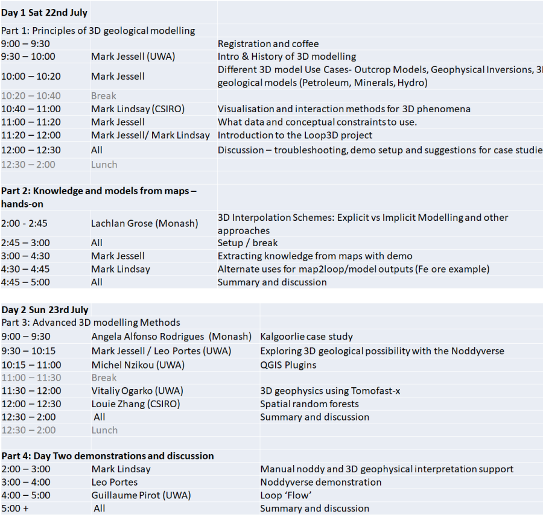

# 6IAS
 6IAS Workshop

## Things to know and do

**Location:**
Notre Dame University in Fremantle. The building is No. 46 ([map](https://github.com/Loop3D/6IAS/blob/main/NotreDame_Campus%20Map_FREMANTLE%202023_R1.pdf)). The physical [Google Maps](https://goo.gl/maps/uPVoFGUEQ2eZNeb18) address is 25 Phillimore St, Fremantle WA 6160.
The room is located on the second floor, access via lifts or stairs (room number is ND46/302).
 
**Catering:**
Lunch, morning and afternoon tea.
 
**What to bring:**
A laptop, preferably with a “Windows” OS for using Noddy (see below) and power adapters.
 
**There are hands-on exercises. To take part, you will need:**
A Google account (for Google Colab).
The workshop materials are in here (currently a work-in-progress).
Install the ‘Noddy’ application – installer is 'OpenNoddy_installer.exe' in the repository. You’ll need administrator access to install, so please get in touch with your IT people if required.

## Noddyverse Examples   
http://13.211.217.129/6IAS/integrated-data-vis%202.html   
http://13.211.217.129/6IAS/InteractivePlot-df_t-sne_noddy-verse_TILT_TILT-integrated-N905-perplexity80.html   
http://13.211.217.129/6IAS/InteractivePlot-df_t-sne_noddy-verse-integrated-N100-perplexity200.html   
http://13.211.217.129/6IAS/InteractivePlot-df_t-sne_noddy-verse-integrated-N905-perplexity500.html   
